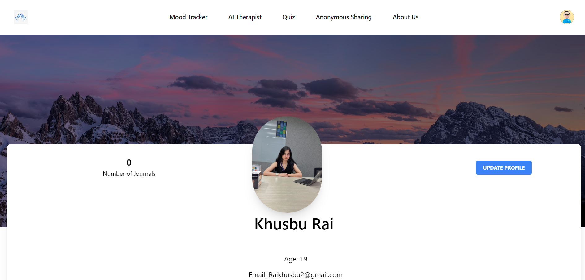
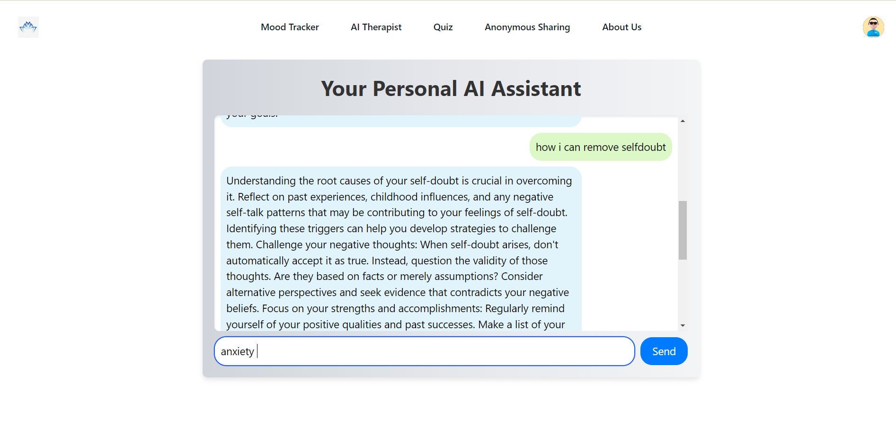
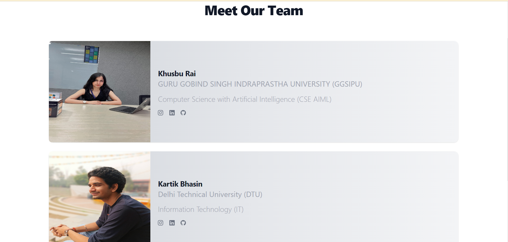
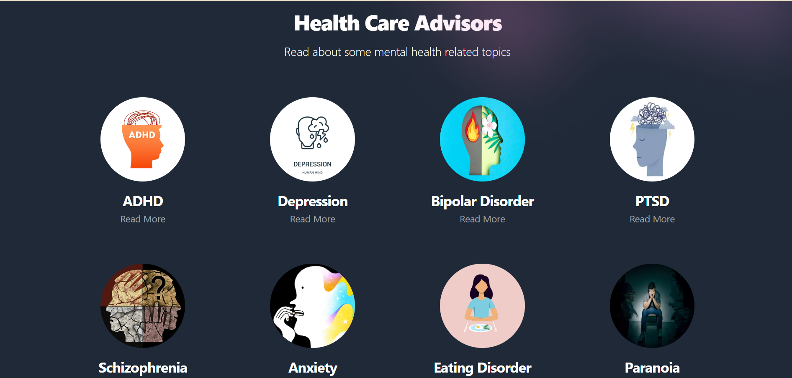
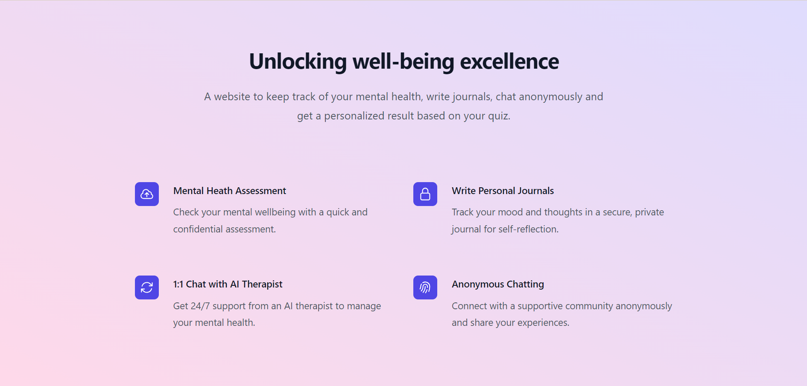

## HealthMate: Unlocking Well-Being Excellence

HealthMate is an AI-powered mental health assistant designed to provide comprehensive support for mental well-being. Our application integrates multiple features to ensure users receive the best possible care and resources for their mental health journey.

### Features:--

1) Mental Health Assessment: Quickly and confidentially assess your mental well-being with our easy-to-use assessment tool. Gain insights into your mental health and take proactive steps towards improvement.

2) Write Personal Journals: Maintain a secure and private journal for self-reflection. Track your mood and document your thoughts in a safe space where your privacy is our priority.

3) 1:1 Chat with AI Therapist: Access 24/7 support from our AI therapist. Receive personalized advice and manage your mental health with a virtual therapist who is always available to listen and guide you.

4) Anonymous Chatting: Connect with a supportive community through anonymous chatting. Share your experiences and seek advice in a non-judgmental environment where your identity remains confidential.

5) Login/Sign-Up Page: Secure login and sign-up pages to ensure your data remains private and accessible only to you.

6) Disease Helpline Numbers and Information: Access a comprehensive list of helpline numbers and detailed information about various mental health conditions.

### Tech Stack

- **Frontend**: React, HTML, CSS, JavaScript
- **Backend**: Node.js, Express
- **Database**: MongoDB

### Screenshots

Here are some screenshots demonstrating the core features of HealthMate. These images provide a visual overview of the user interface and functionality of the application:

License

This project is licensed under the MIT License. See the LICENSE file for details. By using or contributing to this project, you agree to abide by the terms of this license.
